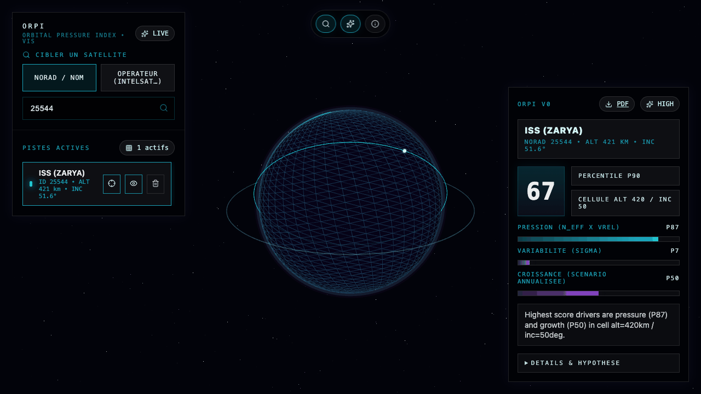
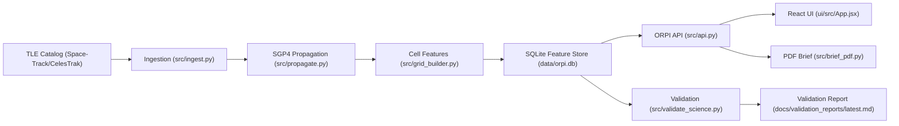

# ORPI - Orbital Risk Pressure Index
[](docs/model_cards/ORPI_v1.1.0_MODEL_CARD.md)
[](docs/validation_reports/latest.md)
[](requirements.txt)
[](src/api.py)
[](ui/src/App.jsx)
[](data/orpi.db)

ORPI is a comparative orbital environment pressure index for insurance underwriting workflows.
It ranks orbital zones (LEO/MEO/GEO) with fast, explainable outputs.

ORPI is not an event-level conjunction predictor.

## Screenshots

### Orbit animation (v2)


### Orbit preview poster


## What ORPI provides
- Offline pipeline: ingest -> propagate -> grid features.
- Fast API scoring endpoint with explainability and confidence decomposition.
- Shareable one-page PDF underwriting brief per NORAD ID.
- Interactive 3D UI (Earth, orbital paths, satellite selection).
- Scientific validation report with separability, stability, freshness, and rolling mini-backtest.

## Architecture



## Repository layout

```text
src/
  ingest.py              # TLE ingestion (Space-Track / CelesTrak)
  propagate.py           # SGP4 sample generation
  grid_builder.py        # Cell feature builder (N_eff, Vrel_proxy, sigma, trend)
  api.py                 # FastAPI endpoints + ORPI scoring
  brief_pdf.py           # PDF underwriting brief renderer
  validate_science.py    # Scientific validation + rolling backtest
ui/
  src/App.jsx            # 3D orbital viewer + underwriting panel
docs/
  model_cards/ORPI_v1.1.0_MODEL_CARD.md
  validation_cards/ORPI_v1.1.0_VALIDATION_CARD.md
  validation_reports/latest.md
data/
  tle/latest.txt
  orpi.db
```

## Quick start

### 1) Install dependencies
```bash
make setup
```

### 2) Run backend + UI
```bash
make dev
```
- API: `http://127.0.0.1:8000`
- UI: `http://127.0.0.1:5173`

### 3) Stop local services
```bash
make stop
```

## Data pipeline

### Offline reproducible run (uses existing `data/tle/latest.txt`)
```bash
make full-pipeline-offline
```

### Online refresh + full run
```bash
make full-pipeline
```

### Step-by-step
```bash
make ingest
make propagate
make grid
make validate
make validate-science
```

## API examples

### Health
```bash
curl "http://127.0.0.1:8000/health"
```

### Search satellites
```bash
curl "http://127.0.0.1:8000/api/satellites/search?q=INTELSAT"
```

### ORPI score
```bash
curl "http://127.0.0.1:8000/api/orpi/score?altitude=550&inclination=53"
```

Example output (trimmed):
```json
{
  "orpi_score": 62.9,
  "percentile": 80.89,
  "rating": "HIGH",
  "confidence_score": 99.92,
  "justification": "Highest score drivers are pressure (P82) and growth (P50) in cell alt=550km / inc=52deg."
}
```

### Generate underwriting PDF brief
```bash
curl -L "http://127.0.0.1:8000/api/brief/25544.pdf" -o ORPI_Brief_25544.pdf
```

## ORPI scoring model (v1.1.0)

Top-level score:

```text
ORPI = 0.62 * PressureBlock + 0.14 * VolatilityBlock + 0.24 * GrowthBlock
```

Pressure block decomposition:

```text
PressureBlock = 0.50 * Exposure + 0.10 * Congestion + 0.40 * Geometry
```

Confidence layer:

```text
Confidence = 0.40 * Freshness + 0.35 * Coverage + 0.25 * Stability
```

Reference docs:
- Model card: `docs/model_cards/ORPI_v1.1.0_MODEL_CARD.md`
- Validation card: `docs/validation_cards/ORPI_v1.1.0_VALIDATION_CARD.md`
- Latest validation report: `docs/validation_reports/latest.md`

## Validation strategy

`src/validate_science.py` checks:
- Distinguishability between reference orbits.
- Temporal stability across recent batches.
- TLE freshness (epoch age distribution).
- Rolling mini-backtest over 3-6 consecutive snapshots.

Run strict gates:
```bash
python3 src/validate_science.py --strict --output docs/validation_reports/latest.md
```

## Docker

```bash
make docker-up
make docker-down
```

## Quality and release checks

```bash
python3 -m compileall -q src
npm -C ui run lint
./scripts/public_audit.sh
```

## Security
- Never commit `.env` or credentials.
- Keep Space-Track credentials local only.
- Secret scanning workflow is defined in `.github/workflows/security.yml`.
- See `SECURITY.md` for policy and reporting.

## Current limits
- Comparative index only (not collision event prediction).
- No covariance propagation in v1.
- No maneuver intent modeling in v1.
- Scenario growth is declarative and must be interpreted as scenario-based.

## Roadmap
- Expand validation set and historical backtesting windows.
- Add confidence drift monitoring dashboards.
- Improve scenario governance and versioning metadata.
- Add optional uncertainty/maneuver modules in future model versions.
